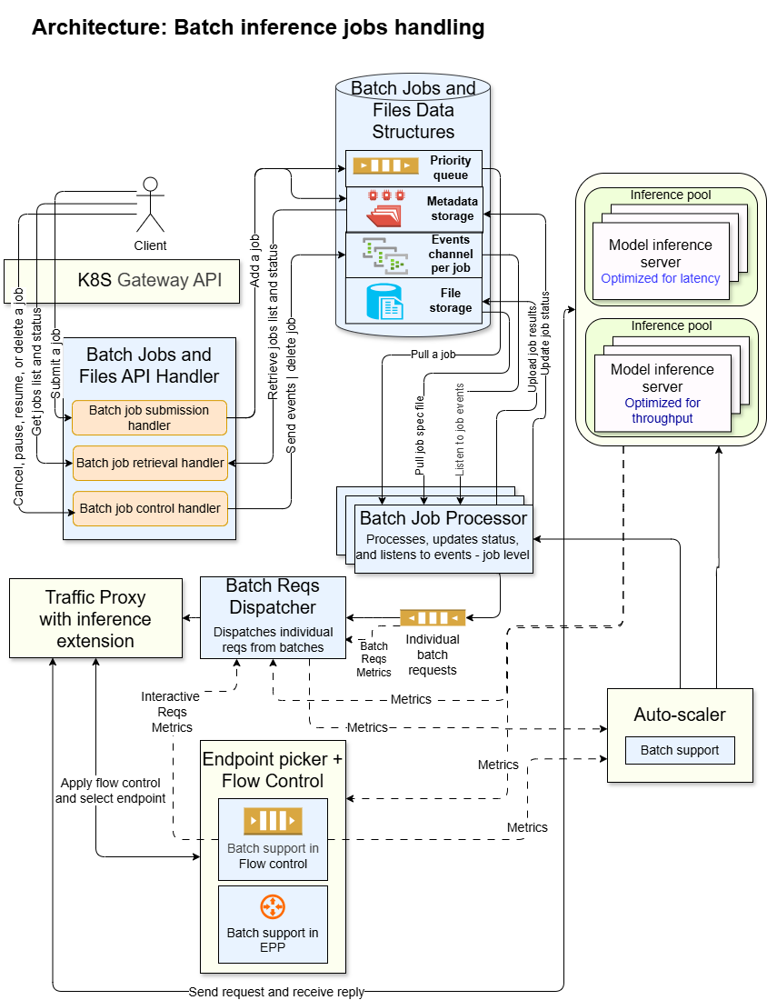

# Batch Gateway

[](https://golang.org/)
[](LICENSE)

## Overview

Batch Gateway is a high-performance system for processing large-scale batch inference jobs in Kubernetes environments. It provides an OpenAI-compatible API for submitting, tracking, and managing batch inference jobs.

The system is designed to facilitate efficient processing of batch workloads in combination with interactive workloads. It minimizes interference with interactive workloads while satisfying batch jobs' service level objectives (SLOs).

### Use Cases

- Inferencing large datasets.
- Generating embeddings for large corpora.
- Model evaluations and testing.
- Offline analysis and batch processing.
- Cost-optimized inference using differential billing for batch vs. interactive workloads.

## Key Features

### Batch Processing

- **OpenAI API Compatibility**: Full schema parity with OpenAI's `/v1/batches` and `/v1/files` endpoints.
- **Large-Scale Processing**: Support for up to 50,000 requests per job.
- **Progress Tracking**: Real-time job status progress updates.
- **Job Management and Control**: Enables to manage and control batch jobs, before, during, and after their processing.
- **Model-Aware Scheduling**: Groups and orders requests by model and system prompt for optimal downstream utilization.
- **Intelligent inference dispatching**: Monitors downstream metrics to determine the flow volume of batch inference requests.

### System Design

- **Deployment Flexibility**: Separate API server, batch processor, and request dispatcher components for independent scaling.
- **Pluggable Storage Backends**: Supports pluggable storage backends for files, metadata, and queues.
- **Fault Tolerance**: Automatic recovery from batch processor crashes.

### Operations

- **Kubernetes Native**: Helm charts with OpenShift compatibility.
- **Observability**: Prometheus metrics and Open Telemetry integration.
- **Health Checks**: Liveness and readiness probes for the system components.
- **Security**: TLS support, non-root execution, capability dropping, read-only filesystem.

## Architecture

### High-Level System Design



### Components

1. **API Server** ([`batch-gateway-apiserver`](cmd/apiserver))
   - Handles REST API requests for batch job submission, management and tracking, as well as file management.
   - Exposes OpenAI-compatible `/v1/batches` and `/v1/files` endpoints.

2. **Batch Processor** ([`batch-gateway-processor`](cmd/batch-processor))
   - Pulls a batch job from a priority queue, and gets its associated file of inference requests.
   - Pre-processes the batch file and builds per-model execution plans.
   - Sends downstream individual inference requests from the batch file, with per-model and global concurrency control.
   - Writes results to an output file.
   - Updates job status.
   - Listens to job events (e.g. cancellation) during job processing.

3. **Data Layer**
   - Manages batch input and output files, batch jobs' and files' metadata, priority queue, events and status mechanisms.
   - Supports pluggable backends.
   - Backends available out of the box:
     - Job and file metadata storage: `PostgreSQL`.
     - Priority queue, event channels, and status updates: `Redis`.
     - File storage: `S3`, `filesystem`.

4. **Batch Dispatcher**
   - Implements intelligent flow control to balance batch and interactive workloads.
   - Monitors downstream inference system metrics (e.g. queue depth, latency, utilization).
   - Dynamically adjusts dispatch flow of batch requests based on downstream system load, to minimize interference with interactive requests while meeting batch jobs SLOs.
   - Provides backpressure mechanisms to prevent overwhelming downstream inference engines.

### Processing Flow

```text
User → API Server → PostgreSQL (metadata) + Redis (queue) + S3 (input file)
                         ↓
                  Priority Queue
                         ↓
                  Batch Processor (pulls jobs)
                         ↓
              Ingestion
                  - Obtain input file
                  - Parse model IDs and system prompts
                  - Build per-model plans
                  - Write plans to local disk
                         ↓
              Execution
                  - Launch per-model goroutines
                  - Acquire global & per-model semaphores
                  - Read requests from plan files
                  - Send to inference gateway
                  - Write results to output file
                         ↓
                  Upload Results to S3
                         ↓
                  Update Job Status
```

### Design Documents

For detailed architecture information see:

- [Batch Inference Architecture](docs/design/batch_inference_architecture.md) - Overall system design and requirements.
- [Batch Processor Architecture](docs/design/batch_processor_architecture.md) - Detailed batch processor design.
- [Batch Dispatcher](docs/design/batch-dispatcher.md) - Dispatch flow control mechanism.
- [MaaS integration](docs/design/maas-integration.md) - Integration with the MaaS component.
- [Resource Lifecycle](docs/design/resource-lifecycle.md) - Job and file state management.

## Repository Structure

```text
batch-gateway/
├── cmd/                          # Application entry points
│   ├── apiserver/                # API server binary
│   └── batch-processor/          # Batch processor binary
├── internal/                     # Private application code
│   ├── apiserver/                # API server implementation
│   │   ├── batch/                # Batch job handlers
│   │   ├── file/                 # File handlers
│   │   ├── common/               # Shared handler utilities
│   │   ├── health/               # Health check handler
│   │   ├── middleware/           # HTTP middleware
│   │   ├── readiness/            # Readiness handler
│   │   ├── metrics/              # Metrics mechanism
│   │   └── server/               # Server initialization
│   ├── processor/                # Batch processor implementation
│   │   ├── worker/               # Worker pool, planning, and execution
│   │   ├── config/               # Processor configuration
│   │   └── metrics/              # Prometheus metrics
│   ├── database/                 # Database clients
│   │   ├── api/                  # Database interfaces
│   │   ├── redis/                # Redis implementation
│   │   └── postgresql/           # PostgreSQL implementation
│   ├── files_store/              # File storage clients (S3, FS)
│   ├── inference/                # Inference gateway HTTP client
│   ├── shared/                   # Shared types and utilities
│   └── util/                     # Common utilities (logging, TLS, etc.)
├── charts/                       # Helm charts
│   └── batch-gateway/            # Kubernetes deployment manifests
├── docs/                         # Documentation
│   ├── design/                   # Architecture and design documents
│   └── guides/                   # Developer and user guides
├── test/                         # Test suites
│   └── e2e/                      # End-to-end tests
├── docker/                       # Dockerfiles
│   ├── Dockerfile.apiserver      # API server container image
│   └── Dockerfile.processor      # Processor container image
├── scripts/                      # Development and deployment scripts
├── Makefile                      # Build and development targets
└── go.mod                        # Go module dependencies
```

### Key Directories

- **`cmd/`**: Contains `main.go` entry points for the components' binaries.
- **`internal/`**: All private application code, organized by component.
- **`charts/`**: Helm chart for deploying the components in Kubernetes.
- **`docs/design/`**: Detailed architecture documents with diagrams explaining the batch processing system.
- **`test/`**: Integration and E2E test suites for validating the full system.

## Getting Started

### Prerequisites

- Go 1.25 or later.
- PostgreSQL 12+ (for metadata storage).
- Redis 6+ (for job queue).
- S3-compatible object storage or local filesystem.
- Docker or Podman (for containerized deployment).
- Kubernetes 1.19+ and Helm 3.0+ (for Kubernetes deployment).

### Local Development

#### 1. Build Binaries

```bash
# Build all the components
make build

# Or build individually
make build-apiserver
make build-processor
```

#### 2. Run Tests

```bash
# Run all unit tests
make test

# Run with coverage
make test-coverage

# Run integration tests
make test-integration

# Run E2E tests (requires running server)
make test-e2e
```

#### 3. Run Locally

Configure the components via YAML configuration files (see `cmd/apiserver/config.yaml` and `cmd/batch-processor/config.yaml` for examples).

```bash
# Run API server
make run-apiserver

# Run processor (in another terminal)
make run-processor

# Or with verbose logging
make run-apiserver-dev
make run-processor-dev
```

### Kubernetes Deployment

#### Quick Start with Kind

Deploy to a local Kind cluster for development:

```bash
# Creates cluster, builds images, and deploys with Helm
make dev-deploy
```

For detailed instructions, see [Development Guide](docs/guides/development.md).

#### Production Deployment

```bash
# Install API server only (default)
helm install batch-gateway ./charts/batch-gateway

# Install with processor enabled
helm install batch-gateway ./charts/batch-gateway \
  --set processor.enabled=true \
  --set processor.replicaCount=3
```

See [Helm Chart README](charts/batch-gateway/README.md) for full configuration options.

### Docker Images

```bash
# Build all images
make image-build

# Or build individually
make image-build-apiserver
make image-build-processor
```

Images are published to:

- `ghcr.io/llm-d-incubation/batch-gateway-apiserver`
- `ghcr.io/llm-d-incubation/batch-gateway-processor`

## API Usage

### Submit a Batch Job

```bash
# 1. Upload input file
curl -X POST http://localhost:8000/v1/files \
  -H "Content-Type: multipart/form-data" \
  -F "file=@batch_requests.jsonl" \
  -F "purpose=batch"

# Response: {"id": "file_abc123", ...}

# 2. Create batch job
curl -X POST http://localhost:8000/v1/batches \
  -H "Content-Type: application/json" \
  -d '{
    "input_file_id": "file_abc123",
    "endpoint": "/v1/chat/completions",
    "completion_window": "24h"
  }'

# Response: {"id": "batch_xyz789", "status": "validating", ...}
```

### Check Job Status

```bash
curl http://localhost:8000/v1/batches/batch_xyz789

# Response includes status: validating, in_progress, finalizing, completed, failed, expired, cancelled
```

### Retrieve Results

```bash
# Get output file ID from batch status
curl http://localhost:8000/v1/batches/batch_xyz789 | jq -r '.output_file_id'

# Download results
curl http://localhost:8000/v1/files/file-output123/content > results.jsonl
```

For complete API documentation, see the [OpenAI Batch API reference](https://platform.openai.com/docs/guides/batch).

## Configuration

### API Server Configuration

See configuration example in `cmd/apiserver/config.yaml`.

### Batch Processor Configuration

See configuration example in `cmd/batch-processor/config.yaml`.

## Monitoring

### Metrics

The batch gateway components expose Prometheus metrics for monitoring.
For a complete list of available metrics, see [docs/guides/metrics.md](docs/guides/metrics.md).

### Health Checks

**API Server:**

- Health: `GET /health` (port 8000).
- Readiness: `GET /ready` (port 8000).

**Processor:**

- Health: `GET /health` (port 9090).
- Readiness: `GET /ready` (port 9090).

## Development

### Code Quality

```bash
# Format code
make fmt

# Run linter
make lint

# Run static analysis
make vet

# Run all checks
make ci
```

### Install Development Tools

```bash
make install-tools
```

This installs:

- `golangci-lint` - Linting and static analysis

### Project Structure Conventions

- Use `internal/` for all private code (not intended for external import).
- Place shared types in `internal/shared/`.
- Keep component-specific code in dedicated subdirectories (`internal/apiserver/`, `internal/processor/`).
- Write unit tests alongside implementation files (`*_test.go`).
- Place E2E tests in `test/e2e/`.

## Contributing

Contributions are welcome! Please ensure:

1. All tests pass: `make test-all`.
2. Code is formatted: `make fmt`.
3. Linter passes: `make lint`.
4. New features include tests and documentation.
5. Commits follow conventional commit format.

## Security

This project follows security best practices:

- Non-root container execution (UID 65532).
- Read-only root filesystem.
- All Linux capabilities dropped.
- No privilege escalation.
- Seccomp profile enabled.
- TLS support for all network communication.
- OpenShift SCC compatibility.

To report security vulnerabilities, please contact the maintainers privately.

## License

Copyright 2026 The llm-d Authors

Licensed under the Apache License, Version 2.0 (the "License");
you may not use this file except in compliance with the License.
You may obtain a copy of the License at

```text
http://www.apache.org/licenses/LICENSE-2.0
```

Unless required by applicable law or agreed to in writing, software
distributed under the License is distributed on an "AS IS" BASIS,
WITHOUT WARRANTIES OR CONDITIONS OF ANY KIND, either express or implied.
See the License for the specific language governing permissions and
limitations under the License.

## Related Projects

- [llm-d-inference-scheduler](https://github.com/llm-d/llm-d-inference-scheduler) - Inference request scheduler.
- [gateway-api-inference-extension](https://github.com/kubernetes-sigs/gateway-api-inference-extension) - Kubernetes Gateway API extensions for inference workloads.

## Support

For help and support:

- Open an issue on GitHub.
- Review the [design documentation](docs/design/).
- Check the [development guide](docs/guides/development.md).
