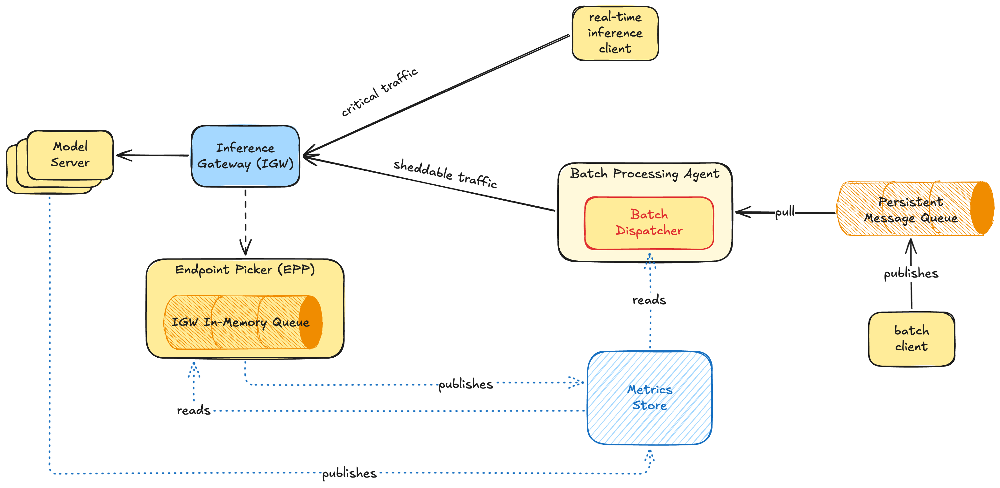

# Batch Dispatcher

Related:
- [\[Public Doc\] Serving Online Batch via Inference Gateway](https://docs.google.com/document/d/1notkq9s0qOmWmUNonZ8CfI-5jtGtHA4PGMI-xz8sGRE/edit?tab=t.0#heading=h.i76kzr3j3swj)
- [\[PUBLIC\] EPP Flow Controller for Priority, Fairness, and Queuing](https://docs.google.com/document/d/1VZL7opFWuwgWquvgiOzLlXAJ633qZ9U-A0ZixGjBgaI/edit?tab=t.0#heading=h.hfyow92z2d0t)
- [\[PUBLIC\] Improved Flow Control Request Management](https://docs.google.com/document/d/1JxzJc8gNv2wKK5-a8ohb0btn78ymVKw9XMIb4-S-ncA/edit?tab=t.0#heading=h.rutawybt03nl)
- [https://gateway-api-inference-extension.sigs.k8s.io/api-types/inferencepool/](https://gateway-api-inference-extension.sigs.k8s.io/api-types/inferencepool/)

## Summary

This document proposes the introduction of a **Batch Dispatcher** to extend the existing "online batch processing agent" architecture (see [\[Public Doc\] Serving Online Batch via Inference Gateway](https://docs.google.com/document/d/1notkq9s0qOmWmUNonZ8CfI-5jtGtHA4PGMI-xz8sGRE/edit?tab=t.0#heading=h.i76kzr3j3swj)). While the **Inference Gateway (IGW)** acts as the primary component for scheduling and flow control, the Batch Dispatcher serves as a system-load aware gatekeeper. It ensures that batch workloads (low-priority and sheddable) are pulled from message queues and forwarded to the IGW only when the inference pool has sufficient capacity. This prevents low-priority traffic from flooding the system and competing with realtime requests.

## Problem statement

The current IGW provides flow control, but a naive approach to batch processing without considering system limits can lead to competing for resources with higher-priority, interactive requests. Batch requests should not be blindly forwarded or retried without a mechanism to honor saturation thresholds; batch workloads may cause inefficient resource utilization or interfere with realtime traffic.

## Guiding Principles and Objectives

* **Reactive Flow Control:** Implement a best-effort, partially proactive mechanism to protect the system from unexpected overloads.
* **Decoupled Architecture:** Keep the IGW as an independent, shared service while the Batch Dispatcher manages the "push" rate of sheddable workloads.

#### **Goals**

* Prevent online batch components from flooding the system, disrupting interactive traffic.
* Use existing and future metrics (e.g., "Dispatch Budget") to manage dispatching.
* Ensure batch workloads are configured with sheddable objectives to share capacity with realtime traffic.

#### **Non-Goals**

* **Fully Proactive Scheduling:** The scheduler remains mostly reactive.
* **Multi-tenancy/Policy Management:** Detailed tenant discrimination or complex priority queue policies are currently out of scope.

## Proposal

The Batch Dispatcher sits between the message queue and the L7 Proxy. It may be thought of as an extension to the Batch Processing Agent in [\[Public Doc\] Serving Online Batch via Inference Gateway](https://docs.google.com/document/d/1notkq9s0qOmWmUNonZ8CfI-5jtGtHA4PGMI-xz8sGRE/edit?tab=t.0#heading=h.i76kzr3j3swj)

Because there is one InferencePool and one EPP per (base) model (see [InferencePool \- Kubernetes Gateway API Inference Extension](https://gateway-api-inference-extension.sigs.k8s.io/api-types/inferencepool/)), there should be **one Batch Dispatcher per InferencePool**.

#### **Key Components**

* **Batch Processing Agent:** The component described in [\[Public Doc\] Serving Online Batch via Inference Gateway](https://docs.google.com/document/d/1notkq9s0qOmWmUNonZ8CfI-5jtGtHA4PGMI-xz8sGRE/edit?tab=t.0#heading=h.i76kzr3j3swj)
* **Batch Dispatcher:** A component that reads flow-control metrics, determines a "Dispatch Budget", and forwards sheddable traffic to the Inference Gateway (it could be realized as a standalone container, possibly an EPP pod sidecar; or it can be thought of as part of the **Batch Processing Agent**)
* **Message Queue:** A persistent store (e.g., Redis, Pub/Sub, Kafka) that holds asynchronous requests. The queue is a priority queue, sorted according to some policy (e.g. an SLO, tenancy, etc: out of scope here)
* **Metrics Store:** Provides real-time data on **Inference Pool usage**.
* **Inference Gateway (IGW):** L7 Proxy \+ Endpoint Picker (EPP) \+ any other accessory service, it handles the final routing to model servers.

## Detailed Approach

The **Batch Dispatcher** pulls requests from the Message Queue, reads metrics from a **Metrics Store** and decides whether to forward them to the IGW: when the metrics are within a certain interval the "gates" are open, and a certain number of requests may go through. Otherwise, the Batch Dispatcher waits until the metrics return within the acceptable range.

### Dispatch Budget

In addition to forwarding the requests, we also propose a simple aggregated metric that we call a "**Dispatch Budget"**, to determine **the number of concurrent batch requests** allowed to enter the IGW at a given time.

Using the following definitions:

* $\mathrm{cur}_\mathrm{SYS}$: a measure of currently used system resources
  * at the time of writing: number of requests
  * in the future: number of bytes, number of tokens etc

* $\mathrm{max}_\mathrm{SYS}$: a measure of available resources
  * at the time of writing: total number of possible requests
  * in the future: total number of bytes, total number of tokens etc

* $\mathrm{cur}_\mathrm{EPP}$: a measure of currently used EPP resources
  * e.g.: number of requests in the EPP internal queues
  * possibly: number of bytes, number of tokens etc; as long as consistent with
    $\mathrm{cur}\_\mathrm{SYS}$ and $\mathrm{max}_\mathrm{SYS}$

  *Note:* given the variability in size of the requests, $\mathrm{max}_\mathrm{SYS}$ is currently meant to be a statically-configured parameter. However this could be turned into readable metrics as well

We define the following formulas:

* **Saturation**: a measure of "fullness" of the system, slightly reformulated from the metric described in [\[PUBLIC\] Improved Flow Control Request Management](https://docs.google.com/document/d/1JxzJc8gNv2wKK5-a8ohb0btn78ymVKw9XMIb4-S-ncA/edit?tab=t.0)
  $\mathrm{F}\_\mathrm{SYS} = \frac{\mathrm{cur}\_\mathrm{SYS}}{\mathrm{max}\_\mathrm{SYS}}$
* **Virtual Load** of the EPP: a measure of **fullness** as F, but relative to the internal queues of the EPP
  $\mathrm{F}\_\mathrm{EPP} = \frac{\mathrm{cur}\_\mathrm{EPP}}{\mathrm{max}\_\mathrm{SYS}}$
* A configurable **Reserved Baseline** (e.g., *B \= 0.05*) reserved for unexpected bursts in high-priority realtime traffic.

Then, **Dispatch Budget** is a combined view of pool **Saturation,** **EPP Virtual Load**, and the **Reserved Baseline**. Because the denominator for   $\mathrm{F}\_\mathrm{SYS}$ and $\mathrm{F}\_\mathrm{EPP}$ is always $\mathrm{max}\_\mathrm{SYS}$, then we can write:

$D = 1 -(\mathrm{F}\_\mathrm{SYS}+\mathrm{F}\_\mathrm{EPP}+B)$

For a given Dispatch Budget, the expected remaining capacity of the system is just

$\mathrm{max}_\mathrm{SYS}\times D$
#### Example

$\mathrm{F}\_\mathrm{SYS} = 0.5,   \quad    \mathrm{F}\_\mathrm{EPP} = 0.1, \quad     B=0.05$

- Dispatch Budget \= *1 \- (0.5 \+ 0.1 \+ 0.05) \= 0.35*
- $\mathrm{max}\_\mathrm{SYS} = 50$ requests
- Dispatchable Requests \= *floor(50 \* 0.35) \= 17* requests in parallel

### Request Lifecycle and Flow Control

The **Batch Dispatcher** monitors the metrics and computes a **Dispatch Budget**.

* When the Dispatch Budget *D* is **within a given range** \[0,u\], where **1** indicates **100%** of system capacity, and u**\<1,** then the Batch Dispatcher may forward ($\mathrm{max}\_\mathrm{SYS} \times D$) requests at once.
* When $D>u$, then the Batch Dispatcher should stop forwarding requests until again $D\leq u$

#### Failure Modes

* **Queue Consumer Failures:** If the Batch Dispatcher pod crashes, the messages remain in the persistent Message Queue (Redis/PubSub), ensuring no data loss.
* **IGW Backpressure:** If the IGW returns an HTTP error indicating overload (e.g. HTTP 429\) despite the computed budget, then the **saturation is assumed to be close to 1**, and therefore a **dispatch budget close to 0\.** The Batch Dispatcher will not retry until a subsequent update from the metrics store will bring it back within the acceptable limits.
  * This might happen if a sudden spike of traffic enters the gateway and the metrics did not update on-time.
* **Unreadable Metrics:** In case of unreadable metrics, the Batch Processor cannot take informed decisions, and therefore will assume a **dispatch budget of 0\.**

### Deployment Model

We propose two alternative strategies for deployment

1. **Self-Contained Deployment:** A component in the **batch processing agent** described [\[Public Doc\] Serving Online Batch via Inference Gateway](https://docs.google.com/document/d/1notkq9s0qOmWmUNonZ8CfI-5jtGtHA4PGMI-xz8sGRE/edit?tab=t.0#heading=h.i76kzr3j3swj), effectively implementing a "strategy" to pull and forward requests from Message Queue to the IGW.
2. **EPP Extension/Sidecar:** The scheduler lives within the same Pod as the EPP. This allows the scheduler to potentially access shared memory or local IPC for fast updates on model server saturation, bypassing metrics scraping delays.

For the first iteration, we propose to implement **1**.

## Open Questions & Thinking Points

* **Queue Granularity:** Should there be one queue per **InferencePool** or per model to avoid bottlenecks?

## Potential Improvements

* **Improved Metrics:** Develop heuristics to take into account the actual size/weight of the single request against the system capacity (currently we are only using the number of requests)
* **Active EPP:** Is it worth moving the pull logic directly into the EPP? This would require non-trivial changes to the internals so that a side channel is allowed to enqueue items on the internal HTTP request queues and to publish the results somewhere once they have been served.
* **Metric Latency:** Prometheus scraping adds delay. Should we implement an in-memory shared store between the EPP and Batch Dispatcher for faster updates? Should we instead scrape the metrics directly from the EPP/Inference Servers?
* **Active Notifications:** wake-up the scheduler instead of polling
