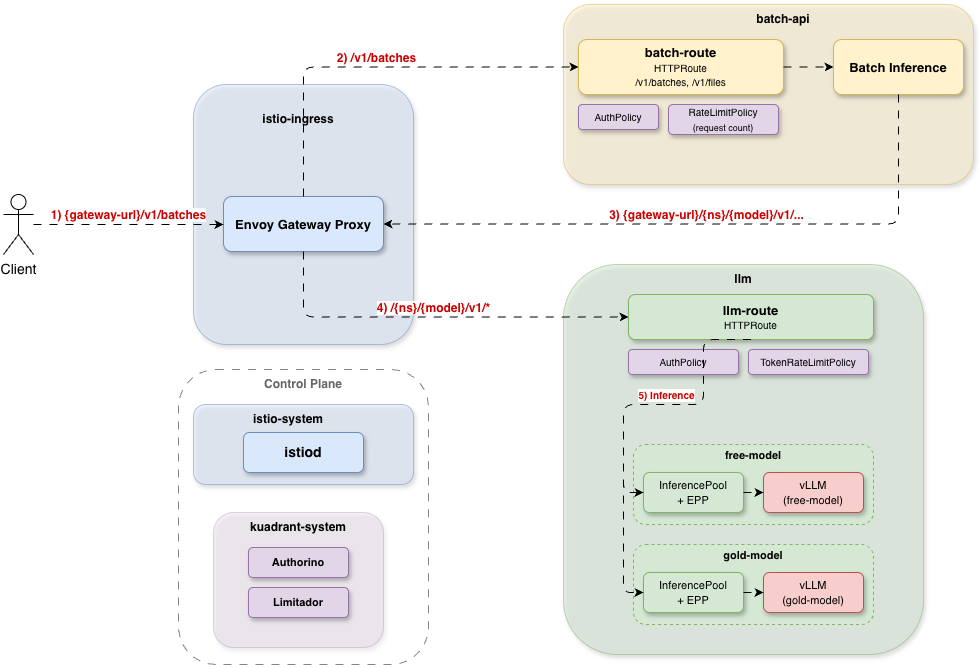

# Batch Inference Integration with Kuadrant

This doc demonstrates how to integrate batch inference with Kuadrant, GAIE, and Istio on any Kubernetes or OpenShift cluster. For the MaaS/ODH-specific integration, see [maas-integration.md](maas-integration.md).

## 1. Architecture



### 1.1 E2E Flow

1. Client sends request to Gateway (e.g. `POST {gateway-url}/v1/batches`)
2. Gateway matches `batch-route`:
   - Authorino authenticates and extracts tier/username/group
   - Limitador enforces request-based rate limiting
   - Forwards to `batch-inference` service
3. `batch-inference` resolves batch request and sends inference request back to Gateway (e.g. `{gateway-url}/{ns}/{model}/v1/...`)
4. Gateway matches `llm-route`:
   - Authorino authenticates, extracts tier/username/group, and checks model-level access
   - Limitador enforces token-based rate limiting
   - Forwards to `EPP` service
5. EPP picks the best vLLM pod, vLLM processes inference and returns response

### 1.2 Component Versions

| Component | Version | Description |
|-----------|---------|-------------|
| Istio | v1.28.0 | Service mesh with Gateway API and GAIE support |
| Kuadrant | 1.3.1 | Gateway policy engine (Authorino + Limitador) |
| Gateway API | v1.1.0 | Kubernetes Gateway API CRDs |
| GAIE | v1.3.1 | Gateway API Inference Extension (InferencePool + EPP) |
| cert-manager | v1.15.3 | TLS certificate management (required by Kuadrant) |

### 1.3 Namespace Layout

| Namespace | Purpose |
|-----------|---------|
| `istio-ingress` | Gateway data plane (Envoy proxy) |
| `istio-system` | Istio control plane (istiod) |
| `kuadrant-system` | Kuadrant operator (Authorino, Limitador) |
| `batch-api` | Batch inference service, batch-route, AuthPolicy, RateLimitPolicy |
| `llm` | Model servers (vLLM), InferencePools, EPP, llm-route, AuthPolicy, TokenRateLimitPolicy |

## 2. Install

### 2.1 Install CRDs

Install the Gateway API and Inference Extension CRDs:

```bash
kubectl apply -f https://github.com/kubernetes-sigs/gateway-api/releases/download/v1.1.0/standard-install.yaml
kubectl apply -f https://github.com/kubernetes-sigs/gateway-api-inference-extension/releases/download/v1.3.1/manifests.yaml
```

### 2.2 Install cert-manager

Kuadrant requires cert-manager. Follow the [cert-manager guide](https://cert-manager.io/docs/installation/helm/) to install:

```bash
helm repo add jetstack https://charts.jetstack.io --force-update
helm install cert-manager jetstack/cert-manager \
    --namespace cert-manager \
    --create-namespace \
    --version v1.15.3 \
    --set crds.enabled=true
```

### 2.3 Install Istio

Follow [Istio Guide](https://istio.io/latest/docs/) to install Istio v1.28.0+ with minimal profile and GAIE support
```bash
# For Kubernetes
istioctl install -y \
    --set components.ingressGateways[0].enabled=false \
    --set values.pilot.env.ENABLE_GATEWAY_API_INFERENCE_EXTENSION=true \
    --set values.pilot.autoscaleEnabled=false

# For OpenShift
istioctl install -y \
    --set components.ingressGateways[0].enabled=false \
    --set values.pilot.env.ENABLE_GATEWAY_API_INFERENCE_EXTENSION=true \
    --set values.pilot.autoscaleEnabled=false \
    --set values.global.platform=openshift
```

### 2.4 Install Kuadrant

Follow the [Kuadrant Guide](https://docs.kuadrant.io/1.3.x/install-helm/) to install Kuadrant 1.3.1

### 2.5 Create Gateway

```bash
kubectl apply -f - <<EOF
# Single entry point for all traffic
# Istio will provision an Envoy proxy pod in the istio-ingress namespace
# kuadrant.io/gateway label enables Kuadrant policy attachment
apiVersion: gateway.networking.k8s.io/v1
kind: Gateway
metadata:
  name: istio-gateway
  namespace: istio-ingress
  labels:
    kuadrant.io/gateway: "true"
spec:
  gatewayClassName: istio
  listeners:
  - name: http
    protocol: HTTP
    port: 80
    allowedRoutes:
      namespaces:
        from: All   # Accept HTTPRoutes from all namespaces
EOF
```

### 2.6 Install Model Servers (vLLM)

Deploy one vLLM instance per model.

```bash
kubectl apply -f - <<EOF
apiVersion: apps/v1
kind: Deployment
metadata:
  name: vllm-free-model
  namespace: llm
spec:
  replicas: 1
  selector:
    matchLabels:
      app: vllm-free-model
  template:
    metadata:
      labels:
        app: vllm-free-model
    spec:
      containers:
      - name: vllm
        image: ghcr.io/llm-d/llm-d-inference-sim:latest
        args: ["--model", "free-model", "--port", "8000"]
        ports:
        - containerPort: 8000
---
apiVersion: v1
kind: Service
metadata:
  name: vllm-free-model
  namespace: llm
  labels:
    app: vllm-free-model
spec:
  selector:
    app: vllm-free-model
  ports:
  - name: http
    protocol: TCP
    port: 8000
    targetPort: 8000
  type: ClusterIP
---
apiVersion: apps/v1
kind: Deployment
metadata:
  name: vllm-gold-model
  namespace: llm
spec:
  replicas: 1
  selector:
    matchLabels:
      app: vllm-gold-model
  template:
    metadata:
      labels:
        app: vllm-gold-model
    spec:
      containers:
      - name: vllm
        image: ghcr.io/llm-d/llm-d-inference-sim:latest
        args: ["--model", "gold-model", "--port", "8000"]
        ports:
        - containerPort: 8000
---
apiVersion: v1
kind: Service
metadata:
  name: vllm-gold-model
  namespace: llm
  labels:
    app: vllm-gold-model
spec:
  selector:
    app: vllm-gold-model
  ports:
  - name: http
    protocol: TCP
    port: 8000
    targetPort: 8000
  type: ClusterIP
EOF
```

### 2.7 Install InferencePools and EPP

Deploy one InferencePool per model via the GAIE Helm chart. The InferencePool name must match the model name (used for authorization):

```bash
# Download GAIE chart from GitHub
GAIE_VERSION=v1.3.1
curl -sL "https://github.com/kubernetes-sigs/gateway-api-inference-extension/archive/refs/tags/${GAIE_VERSION}.tar.gz" \
    | tar -xz -C /tmp
GAIE_CHART="/tmp/gateway-api-inference-extension-${GAIE_VERSION#v}/config/charts/inferencepool"

# InferencePool "free-model" -> selects pods with app=vllm-free-model
# --dependency-update: required to pull sub-chart dependencies
# --set experimentalHttpRoute.enabled=false: disable auto-created HTTPRoute (we create llm-route manually)
helm install free-model \
    --namespace llm \
    --dependency-update \
    --set inferencePool.modelServers.matchLabels.app=vllm-free-model \
    --set inferencePool.modelServerType=vllm \
    --set provider.name=istio \
    --set experimentalHttpRoute.enabled=false \
    --set inferenceExtension.resources.requests.cpu=100m \
    --set inferenceExtension.resources.requests.memory=128Mi \
    --set inferenceExtension.resources.limits.cpu=500m \
    --set inferenceExtension.resources.limits.memory=512Mi \
    "${GAIE_CHART}"

# InferencePool "gold-model" -> selects pods with app=vllm-gold-model
helm install gold-model \
    --namespace llm \
    --dependency-update \
    --set inferencePool.modelServers.matchLabels.app=vllm-gold-model \
    --set inferencePool.modelServerType=vllm \
    --set provider.name=istio \
    --set experimentalHttpRoute.enabled=false \
    --set inferenceExtension.resources.requests.cpu=100m \
    --set inferenceExtension.resources.requests.memory=128Mi \
    --set inferenceExtension.resources.limits.cpu=500m \
    --set inferenceExtension.resources.limits.memory=512Mi \
    "${GAIE_CHART}"
```

### 2.8 Create LLM HTTPRoute

Create HTTPRoute to route LLM inference requests to InferencePools.

```bash
kubectl apply -f - <<EOF
# Routes /{ns}/{model}/v1/* to the corresponding InferencePool
# URL rewrite strips the /{ns}/{model} prefix before forwarding to vLLM
# Each model has 3 rules: /v1/completions, /v1/chat/completions, and a catch-all
apiVersion: gateway.networking.k8s.io/v1
kind: HTTPRoute
metadata:
  name: llm-route
  namespace: llm
spec:
  parentRefs:
  - name: istio-gateway
    namespace: istio-ingress
  rules:
  # free-model
  - matches:
    - path:
        type: PathPrefix
        value: /llm/free-model/v1/completions
    filters:
    - type: URLRewrite
      urlRewrite:
        path:
          type: ReplacePrefixMatch
          replacePrefixMatch: /v1/completions
    backendRefs:
    - group: inference.networking.k8s.io
      kind: InferencePool
      name: free-model
  - matches:
    - path:
        type: PathPrefix
        value: /llm/free-model/v1/chat/completions
    filters:
    - type: URLRewrite
      urlRewrite:
        path:
          type: ReplacePrefixMatch
          replacePrefixMatch: /v1/chat/completions
    backendRefs:
    - group: inference.networking.k8s.io
      kind: InferencePool
      name: free-model
  - matches:
    - path:
        type: PathPrefix
        value: /llm/free-model
    filters:
    - type: URLRewrite
      urlRewrite:
        path:
          type: ReplacePrefixMatch
          replacePrefixMatch: /
    backendRefs:
    - group: inference.networking.k8s.io
      kind: InferencePool
      name: free-model
  # gold-model
  - matches:
    - path:
        type: PathPrefix
        value: /llm/gold-model/v1/completions
    filters:
    - type: URLRewrite
      urlRewrite:
        path:
          type: ReplacePrefixMatch
          replacePrefixMatch: /v1/completions
    backendRefs:
    - group: inference.networking.k8s.io
      kind: InferencePool
      name: gold-model
  - matches:
    - path:
        type: PathPrefix
        value: /llm/gold-model/v1/chat/completions
    filters:
    - type: URLRewrite
      urlRewrite:
        path:
          type: ReplacePrefixMatch
          replacePrefixMatch: /v1/chat/completions
    backendRefs:
    - group: inference.networking.k8s.io
      kind: InferencePool
      name: gold-model
  - matches:
    - path:
        type: PathPrefix
        value: /llm/gold-model
    filters:
    - type: URLRewrite
      urlRewrite:
        path:
          type: ReplacePrefixMatch
          replacePrefixMatch: /
    backendRefs:
    - group: inference.networking.k8s.io
      kind: InferencePool
      name: gold-model
EOF
```

### 2.9 Install Batch Inference Service

Follow the [guide](../../README.md) to install Batch Inference Service

### 2.10 Create Batch HTTPRoute

Create HTTPRoute to route batch requests to batch inference service.

```bash
kubectl apply -f - <<EOF
# Routes batch API requests (/v1/batches, /v1/files) to the batch inference service
apiVersion: gateway.networking.k8s.io/v1
kind: HTTPRoute
metadata:
  name: batch-route
  namespace: batch-api
spec:
  parentRefs:
  - name: istio-gateway
    namespace: istio-ingress
  rules:
  - matches:
    - path:
        type: PathPrefix
        value: /v1/batches
    - path:
        type: PathPrefix
        value: /v1/files
    backendRefs:
    - name: batch-inference
      port: 80
EOF
```

## 3. Rate Limiting

Kuadrant provides two types of rate limiting policies. Both support `counters` for per-user/per-model counting and `when` for conditional matching on any `auth.identity` field or request attribute.

| Policy | Counts | Use Case | API Reference |
|--------|--------|----------|---------------|
| [TokenRateLimitPolicy](https://docs.kuadrant.io/latest/kuadrant-operator/doc/reference/tokenratelimitpolicy/) | LLM tokens in inference responses | LLM inference routes | `kuadrant.io/v1alpha1` |
| [RateLimitPolicy](https://docs.kuadrant.io/latest/kuadrant-operator/doc/reference/ratelimitpolicy/) | HTTP requests | Batch API routes | `kuadrant.io/v1` |

### 3.1 Token-based Rate Limiting for LLM Inference

Apply token-based rate limiting on the llm-route. Unlike RateLimitPolicy which counts HTTP requests, TokenRateLimitPolicy counts **LLM tokens** consumed in inference responses, providing more accurate cost control for AI workloads.

```bash
kubectl apply -f - <<EOF
# Token-based rate limiting on llm-route
# Counts LLM tokens consumed in inference responses
# Tier is extracted by AuthPolicy and available as auth.identity.tier
apiVersion: kuadrant.io/v1alpha1
kind: TokenRateLimitPolicy
metadata:
  name: llm-token-ratelimit
  namespace: llm
spec:
  targetRef:
    group: gateway.networking.k8s.io
    kind: HTTPRoute
    name: llm-route
  limits:
    gold:
      rates:
      - limit: 2000      # 2000 tokens per minute for gold tier
        window: 1m
      when:
      - predicate: "auth.identity.tier == 'gold'"
    free:
      rates:
      - limit: 150        # 150 tokens per minute for free tier
        window: 1m
      when:
      - predicate: "auth.identity.tier == 'free'"
EOF
```

### 3.2 Request-based Rate Limiting for Batch API

Apply request-count based rate limiting on the batch-route. This counts each HTTP request regardless of payload, suitable for APIs where request frequency matters more than payload size.

```bash
kubectl apply -f - <<EOF
# Request-count based rate limiting on batch-route
# Counts each HTTP request regardless of payload
# Tier is extracted by AuthPolicy and available as auth.identity.tier
apiVersion: kuadrant.io/v1
kind: RateLimitPolicy
metadata:
  name: batch-ratelimit
  namespace: batch-api
spec:
  targetRef:
    group: gateway.networking.k8s.io
    kind: HTTPRoute
    name: batch-route
  limits:
    "gold-limit":
      rates:
      - limit: 100        # 100 requests per minute for gold tier
        window: 60s
      when:
      - predicate: "auth.identity.tier == 'gold'"
    "free-limit":
      rates:
      - limit: 5           # 5 requests per 10 seconds for free tier
        window: 10s
      when:
      - predicate: "auth.identity.tier == 'free'"
EOF
```

## 4. Authentication & Authorization

Each AuthPolicy has three independent parts:

| AuthPolicy Section | Purpose | Description |
|---|---|---|
| `authentication` | Identity verification (who are you?) | Validates the credential (API Key lookup or TokenReview) and populates `auth.identity` |
| `authorization` | Access control (can you access this model?) | Checks model-level permission (OPA Rego or SubjectAccessReview). Only on llm-route — batch-route does not need model authorization |
| `response` | Attribute extraction (what tier/identity info?) | Extracts tier, username, group from identity and injects them as HTTP headers (`x-tier`, `x-username`, `x-group`) for downstream rate limiting and backend services |

All three solutions share the same rate limiting policies (Section 3). They differ in how authentication is performed, how tier is determined, and how model-level authorization is enforced.

### 4.1 Option 1: API Key Based

Uses Kuadrant [API Key](https://docs.kuadrant.io/latest/authorino/docs/user-guides/api-key-authentication/) Secrets for authentication and [OPA Rego](https://docs.kuadrant.io/latest/authorino/docs/user-guides/opa-authorization/) for model authorization. Works on any Kubernetes cluster.

#### 4.1.1 Prerequisites

> **Security**: The API keys below are demo values. For production, generate strong random keys (e.g. `openssl rand -hex 32`).

Each API key is a Kubernetes Secret with `tier` and `models` annotations:

```yaml
# Gold tier API key: can access free-model and gold-model
apiVersion: v1
kind: Secret
metadata:
  name: api-key-gold
  namespace: kuadrant-system
  labels:
    app: batch-api                                # Authorino selects secrets by this label
    authorino.kuadrant.io/managed-by: authorino   # Required for Authorino to discover this secret
  annotations:
    username: "gold-user"                         # Username injected as x-username header
    group: "gold"                                 # Group injected as x-group header
    tier: "gold"                                  # Tier for rate limiting
    models: "free-model,gold-model"               # Allowed models for OPA authorization
    secret.kuadrant.io/user-id: "gold-user"       # User identifier for Kuadrant
    kuadrant.io/groups: "gold"                    # Group for Kuadrant
stringData:
  api_key: gold-key-12345
---
# Free tier API key: can only access free-model
apiVersion: v1
kind: Secret
metadata:
  name: api-key-free
  namespace: kuadrant-system
  labels:
    app: batch-api
    authorino.kuadrant.io/managed-by: authorino
  annotations:
    username: "free-user"                         # Username injected as x-username header
    group: "free"                                 # Group injected as x-group header
    tier: "free"
    models: "free-model"                          # No access to gold-model
    secret.kuadrant.io/user-id: "free-user"       # User identifier for Kuadrant
    kuadrant.io/groups: "free"                    # Group for Kuadrant
stringData:
  api_key: free-key-67890
```

#### 4.1.2 Define AuthPolicy

Authenticates requests using API key and extracts tier from Secret annotation:

For batch-route (authentication only, no model-level authorization needed):
```yaml
apiVersion: kuadrant.io/v1
kind: AuthPolicy
metadata:
  name: batch-auth
  namespace: batch-api
spec:
  targetRef:
    group: gateway.networking.k8s.io
    kind: HTTPRoute
    name: batch-route      # Attach to batch-route HTTPRoute
  rules:
    # Step 1: Authentication
    # Authorino looks up the API key in all Secrets with label app=batch-api
    # Client sends header: "Authorization: APIKEY <key>"
    # If matched, auth.identity is populated with the Secret's metadata
    authentication:
      "api-key-authn":
        apiKey:
          allNamespaces: true           # Search Secrets across all namespaces
          selector:
            matchLabels:
              app: batch-api            # Only Secrets with this label
        credentials:
          authorizationHeader:
            prefix: APIKEY              # Expect "Authorization: APIKEY xxx"

    # Step 2: Extract tier for rate limiting
    # Read the "tier" annotation from the matched Secret (e.g. "gold" or "free")
    # and expose it as auth.identity.tier for RateLimitPolicy to consume
    # Also inject x-tier, x-username, x-group headers for downstream services
    response:
      success:
        filters:
          "identity":
            json:
              properties:
                "tier":
                  selector: auth.identity.metadata.annotations.tier
        headers:
          "x-tier":
            plain:
              selector: auth.identity.metadata.annotations.tier
          "x-username":
            plain:
              selector: auth.identity.metadata.annotations.username
          "x-group":
            plain:
              selector: auth.identity.metadata.annotations.group
```

For llm-route (authentication + model-level authorization via OPA):
```yaml
apiVersion: kuadrant.io/v1
kind: AuthPolicy
metadata:
  name: llm-auth
  namespace: llm
spec:
  targetRef:
    group: gateway.networking.k8s.io
    kind: HTTPRoute
    name: llm-route         # Attach to llm-route HTTPRoute
  rules:
    # Step 1: Authentication (same as batch-auth)
    authentication:
      "api-key-authn":
        apiKey:
          allNamespaces: true
          selector:
            matchLabels:
              app: batch-api
        credentials:
          authorizationHeader:
            prefix: APIKEY

    # Step 2: Model-level authorization via OPA Rego
    # Extracts the model name from URL path: /llm/{model}/v1/...
    # Checks if the model is in the Secret's "models" annotation (comma-separated)
    # Example: Secret annotation models="free-model,gold-model"
    #   → request to /llm/gold-model/... → allowed
    #   → request to /llm/gold-model/... with free key (models="free-model") → 403
    authorization:
      "model-access":
        opa:
          rego: |
            path_parts := split(input.context.request.http.path, "/")
            requested_model := path_parts[2]
            allowed_csv := object.get(input.auth.identity.metadata.annotations, "models", "")
            allowed_models := split(allowed_csv, ",")
            allow { allowed_models[_] == requested_model }
          allValues: true

    # Step 3: Extract tier for TokenRateLimitPolicy
    # Also inject x-tier, x-username, x-group headers for downstream services to consume
    response:
      success:
        filters:
          "identity":
            json:
              properties:
                "tier":
                  selector: auth.identity.metadata.annotations.tier
        headers:
          "x-tier":
            plain:
              selector: auth.identity.metadata.annotations.tier
          "x-username":
            plain:
              selector: auth.identity.metadata.annotations.username
          "x-group":
            plain:
              selector: auth.identity.metadata.annotations.group
```

#### 4.1.3 Test

```bash
# Create batch input file
cat > batch-input.jsonl <<EOF
{"custom_id":"req-1","method":"POST","url":"/v1/chat/completions","body":{"model":"free-model","messages":[{"role":"user","content":"Hello"}]}}
{"custom_id":"req-2","method":"POST","url":"/v1/chat/completions","body":{"model":"free-model","messages":[{"role":"user","content":"Tell me a joke"}]}}
EOF

# Upload input file
curl -X POST ${GATEWAY_URL}/v1/files \
    -H "Authorization: APIKEY gold-key-12345" \
    -F purpose=batch \
    -F file=@batch-input.jsonl

# Create batch job with the returned file ID
curl -X POST ${GATEWAY_URL}/v1/batches \
    -H "Authorization: APIKEY gold-key-12345" \
    -H "Content-Type: application/json" \
    -d '{"input_file_id":"file-abc123","endpoint":"/v1/chat/completions","completion_window":"24h"}'
```

### 4.2 Option 2: ServiceAccount Token Based

Uses Kubernetes [ServiceAccount token](https://docs.kuadrant.io/latest/authorino/docs/user-guides/kubernetes-tokenreview/) for authentication and [SubjectAccessReview](https://docs.kuadrant.io/latest/authorino/docs/user-guides/kubernetes-subjectaccessreview/) for model authorization. Works on any Kubernetes cluster.

#### 4.2.1 Prerequisites

Tier is encoded in the SA's namespace name. Kubernetes automatically assigns the group `system:serviceaccounts:{namespace}`:

```bash
# Create tier namespaces - the namespace name encodes the tier
# K8s auto-assigns group "system:serviceaccounts:tier-gold" to all SAs in this namespace
kubectl create namespace tier-gold
kubectl create namespace tier-free
```

```yaml
# Gold tier service account (in tier-gold namespace)
apiVersion: v1
kind: ServiceAccount
metadata:
  name: gold-user
  namespace: tier-gold    # -> group: system:serviceaccounts:tier-gold
---
# Free tier service account (in tier-free namespace)
apiVersion: v1
kind: ServiceAccount
metadata:
  name: free-user
  namespace: tier-free    # -> group: system:serviceaccounts:tier-free
```

#### 4.2.2 Create RBAC

Each model has a Role with `resourceNames` restricting access to a specific InferencePool. RoleBindings grant access to tier groups:

```yaml
# Role: allows "get" on InferencePool "free-model"
# SubjectAccessReview checks this permission when user requests /llm/free-model/*
apiVersion: rbac.authorization.k8s.io/v1
kind: Role
metadata:
  name: free-model-access
  namespace: llm
rules:
- apiGroups: ["inference.networking.k8s.io"]
  resources: ["inferencepools"]
  resourceNames: ["free-model"]       # Must match InferencePool name
  verbs: ["get"]
---
# RoleBinding: grant free-model access to both gold and free tiers
apiVersion: rbac.authorization.k8s.io/v1
kind: RoleBinding
metadata:
  name: free-model-tier-binding
  namespace: llm
subjects:
- kind: Group
  name: system:serviceaccounts:tier-gold   # Gold tier SA group
  apiGroup: rbac.authorization.k8s.io
- kind: Group
  name: system:serviceaccounts:tier-free   # Free tier SA group
  apiGroup: rbac.authorization.k8s.io
roleRef:
  kind: Role
  name: free-model-access
  apiGroup: rbac.authorization.k8s.io
---
# Role: allows "get" on InferencePool "gold-model"
apiVersion: rbac.authorization.k8s.io/v1
kind: Role
metadata:
  name: gold-model-access
  namespace: llm
rules:
- apiGroups: ["inference.networking.k8s.io"]
  resources: ["inferencepools"]
  resourceNames: ["gold-model"]
  verbs: ["get"]
---
# RoleBinding: grant gold-model access to gold tier ONLY (free tier excluded)
apiVersion: rbac.authorization.k8s.io/v1
kind: RoleBinding
metadata:
  name: gold-model-tier-binding
  namespace: llm
subjects:
- kind: Group
  name: system:serviceaccounts:tier-gold   # Only gold tier
  apiGroup: rbac.authorization.k8s.io
roleRef:
  kind: Role
  name: gold-model-access
  apiGroup: rbac.authorization.k8s.io
```

#### 4.2.3 Define AuthPolicy

For batch-route (authentication only, no model-level authorization needed):
```yaml
apiVersion: kuadrant.io/v1
kind: AuthPolicy
metadata:
  name: batch-auth
  namespace: batch-api
spec:
  targetRef:
    group: gateway.networking.k8s.io
    kind: HTTPRoute
    name: batch-route       # Attach to batch-route HTTPRoute
  rules:
    # Step 1: Authentication
    # Authorino sends a TokenReview to the K8s API server to validate the SA token
    # Client sends header: "Authorization: Bearer <sa-token>"
    # If valid, auth.identity is populated with the token's user info (username, groups, etc.)
    authentication:
      "k8s-token":
        kubernetesTokenReview:
          audiences:
          - https://kubernetes.default.svc    # Must match the token's audience

    # Step 2: Extract tier for rate limiting
    # SA in namespace "tier-gold" automatically gets group "system:serviceaccounts:tier-gold"
    # CEL expression: filter groups → strip prefix → get tier name
    # Example: ["system:serviceaccounts:tier-gold", "system:serviceaccounts", ...]
    #   → filter startsWith("system:serviceaccounts:tier-") → ["system:serviceaccounts:tier-gold"]
    #   → replace prefix → ["gold"]
    #   → [0] → "gold"
    # Result: auth.identity.tier = "gold", consumed by RateLimitPolicy
    # Also inject x-tier, x-username, x-group headers for downstream services
    # Note: x-username and x-group use "selector" (JSON path), not "expression" (CEL)
    #   because @tostr is an Authorino JSON path operator, not a CEL function
    response:
      success:
        filters:
          "identity":
            json:
              properties:
                "tier":
                  expression: |
                    auth.identity.user.groups
                      .filter(g, g.startsWith("system:serviceaccounts:tier-"))
                      .map(g, g.replace("system:serviceaccounts:tier-", ""))
                      [0]
        headers:
          "x-tier":
            plain:
              expression: |
                auth.identity.user.groups
                  .filter(g, g.startsWith("system:serviceaccounts:tier-"))
                  .map(g, g.replace("system:serviceaccounts:tier-", ""))
                  [0]
          "x-username":
            plain:
              selector: auth.identity.user.username
          "x-group":
            plain:
              selector: auth.identity.user.groups.@tostr
```

For llm-route (authentication + model-level authorization via SubjectAccessReview):
```yaml
apiVersion: kuadrant.io/v1
kind: AuthPolicy
metadata:
  name: llm-auth
  namespace: llm
spec:
  targetRef:
    group: gateway.networking.k8s.io
    kind: HTTPRoute
    name: llm-route          # Attach to llm-route HTTPRoute
  rules:
    # Step 1: Authentication (same as batch-auth)
    authentication:
      "k8s-token":
        kubernetesTokenReview:
          audiences:
          - https://kubernetes.default.svc

    # Step 2: Model-level authorization via SubjectAccessReview
    # Authorino sends a SubjectAccessReview to the K8s API server asking:
    #   "Can user X (with groups Y) GET inferencepools/{model} in namespace {ns}?"
    # K8s RBAC engine evaluates the Roles/RoleBindings we created in 4.2.2
    # Example: request to /llm/gold-model/v1/chat/completions
    #   → namespace = "llm", name = "gold-model"
    #   → free-user (group system:serviceaccounts:tier-free) → no RoleBinding → 403
    #   → gold-user (group system:serviceaccounts:tier-gold) → has RoleBinding → allowed
    # authorizationGroups passes SA groups to SubjectAccessReview for group-based RBAC
    authorization:
      "model-access":
        kubernetesSubjectAccessReview:
          user:
            expression: auth.identity.user.username
          authorizationGroups:
            expression: auth.identity.user.groups
          resourceAttributes:
            group:
              value: inference.networking.k8s.io
            resource:
              value: inferencepools
            namespace:
              expression: request.path.split("/")[1]   # "llm"
            name:
              expression: request.path.split("/")[2]   # "free-model" or "gold-model"
            verb:
              value: get

    # Step 3: Extract tier for TokenRateLimitPolicy (same CEL as batch-auth)
    # Also inject x-tier, x-username, x-group headers for downstream services to consume
    response:
      success:
        filters:
          "identity":
            json:
              properties:
                "tier":
                  expression: |
                    auth.identity.user.groups
                      .filter(g, g.startsWith("system:serviceaccounts:tier-"))
                      .map(g, g.replace("system:serviceaccounts:tier-", ""))
                      [0]
        headers:
          "x-tier":
            plain:
              expression: |
                auth.identity.user.groups
                  .filter(g, g.startsWith("system:serviceaccounts:tier-"))
                  .map(g, g.replace("system:serviceaccounts:tier-", ""))
                  [0]
          "x-username":
            plain:
              selector: auth.identity.user.username
          "x-group":
            plain:
              selector: auth.identity.user.groups.@tostr
```

#### 4.2.4 Test

```bash
# Create batch input file
cat > batch-input.jsonl <<EOF
{"custom_id":"req-1","method":"POST","url":"/v1/chat/completions","body":{"model":"free-model","messages":[{"role":"user","content":"Hello"}]}}
{"custom_id":"req-2","method":"POST","url":"/v1/chat/completions","body":{"model":"free-model","messages":[{"role":"user","content":"Tell me a joke"}]}}
EOF

TOKEN=$(kubectl create token gold-user -n tier-gold --duration=1h)

# Upload input file
curl -X POST ${GATEWAY_URL}/v1/files \
    -H "Authorization: Bearer $TOKEN" \
    -F purpose=batch \
    -F file=@batch-input.jsonl

# Create batch job
curl -X POST ${GATEWAY_URL}/v1/batches \
    -H "Authorization: Bearer $TOKEN" \
    -H "Content-Type: application/json" \
    -d '{"input_file_id":"file-abc123","endpoint":"/v1/chat/completions","completion_window":"24h"}'
```

### 4.3 Option 3: User Token Based (OpenShift Only)

Uses OpenShift [user tokens](https://docs.openshift.com/container-platform/4.18/authentication/understanding-authentication.html) for authentication and [SubjectAccessReview](https://docs.kuadrant.io/latest/authorino/docs/user-guides/kubernetes-subjectaccessreview/) for model authorization. Requires OpenShift.

#### 4.3.1 Prerequisites

Create users via htpasswd and assign to tier groups:

```bash
# Create OpenShift users via htpasswd identity provider
htpasswd -c -B -b /tmp/htpasswd gold-user gold-pass
htpasswd -B -b /tmp/htpasswd free-user free-pass
oc create secret generic htpass-secret --from-file=htpasswd=/tmp/htpasswd -n openshift-config

# Configure OAuth to use htpasswd identity provider
kubectl apply -f - <<EOF
apiVersion: config.openshift.io/v1
kind: OAuth
metadata:
  name: cluster
spec:
  identityProviders:
  - name: htpasswd_provider
    type: HTPasswd
    mappingMethod: claim
    htpasswd:
      fileData:
        name: htpass-secret
EOF

# Wait for OAuth server to pick up the new configuration
sleep 30

# Create tier groups and assign users
# User tokens will include these groups, used for tier extraction and RBAC
oc adm groups new tier-gold
oc adm groups new tier-free
oc adm groups add-users tier-gold gold-user   # gold-user -> group "tier-gold"
oc adm groups add-users tier-free free-user   # free-user -> group "tier-free"
```

#### 4.3.2 Create RBAC

Same Role structure as SA Token mode, but RoleBinding subjects use OpenShift group names directly:

```yaml
# Role: allows "get" on InferencePool "free-model" (same as SA Token mode)
apiVersion: rbac.authorization.k8s.io/v1
kind: Role
metadata:
  name: free-model-access
  namespace: llm
rules:
- apiGroups: ["inference.networking.k8s.io"]
  resources: ["inferencepools"]
  resourceNames: ["free-model"]
  verbs: ["get"]
---
# RoleBinding: grant free-model access to both tiers
# OpenShift groups are simpler: "tier-gold" instead of "system:serviceaccounts:tier-gold"
apiVersion: rbac.authorization.k8s.io/v1
kind: RoleBinding
metadata:
  name: free-model-tier-binding
  namespace: llm
subjects:
- kind: Group
  name: tier-gold          # OpenShift group (not system:serviceaccounts:...)
  apiGroup: rbac.authorization.k8s.io
- kind: Group
  name: tier-free
  apiGroup: rbac.authorization.k8s.io
roleRef:
  kind: Role
  name: free-model-access
  apiGroup: rbac.authorization.k8s.io
---
# Role: allows "get" on InferencePool "gold-model"
apiVersion: rbac.authorization.k8s.io/v1
kind: Role
metadata:
  name: gold-model-access
  namespace: llm
rules:
- apiGroups: ["inference.networking.k8s.io"]
  resources: ["inferencepools"]
  resourceNames: ["gold-model"]
  verbs: ["get"]
---
# RoleBinding: grant gold-model access to gold tier ONLY
apiVersion: rbac.authorization.k8s.io/v1
kind: RoleBinding
metadata:
  name: gold-model-tier-binding
  namespace: llm
subjects:
- kind: Group
  name: tier-gold          # Only gold tier
  apiGroup: rbac.authorization.k8s.io
roleRef:
  kind: Role
  name: gold-model-access
  apiGroup: rbac.authorization.k8s.io
```

#### 4.3.3 Define AuthPolicy

Same structure as SA Token mode. The only difference is the CEL expression for tier extraction uses `tier-` prefix instead of `system:serviceaccounts:tier-`.

For batch-route (authentication only, no model-level authorization needed):
```yaml
apiVersion: kuadrant.io/v1
kind: AuthPolicy
metadata:
  name: batch-auth
  namespace: batch-api
spec:
  targetRef:
    group: gateway.networking.k8s.io
    kind: HTTPRoute
    name: batch-route
  rules:
    # Step 1: Authentication
    # Authorino sends a TokenReview to the K8s API server to validate the OpenShift user token
    # Client sends header: "Authorization: Bearer <user-token>"
    authentication:
      "k8s-token":
        kubernetesTokenReview:
          audiences:
          - https://kubernetes.default.svc
    # Step 2: Extract tier for rate limiting
    # User in group "tier-gold" -> filter groups → strip "tier-" prefix → "gold"
    # Also inject x-tier, x-username, x-group headers for downstream services
    # Note: x-username and x-group use "selector" (JSON path), not "expression" (CEL)
    #   because @tostr is an Authorino JSON path operator, not a CEL function
    response:
      success:
        filters:
          "identity":
            json:
              properties:
                "tier":
                  expression: |
                    auth.identity.user.groups
                      .filter(g, g.startsWith("tier-"))
                      .map(g, g.replace("tier-", ""))
                      [0]
        headers:
          "x-tier":
            plain:
              expression: |
                auth.identity.user.groups
                  .filter(g, g.startsWith("tier-"))
                  .map(g, g.replace("tier-", ""))
                  [0]
          "x-username":
            plain:
              selector: auth.identity.user.username
          "x-group":
            plain:
              selector: auth.identity.user.groups.@tostr
```

For llm-route:
```yaml
apiVersion: kuadrant.io/v1
kind: AuthPolicy
metadata:
  name: llm-auth
  namespace: llm
spec:
  targetRef:
    group: gateway.networking.k8s.io
    kind: HTTPRoute
    name: llm-route
  rules:
    # Authentication: validate OpenShift user token
    authentication:
      "k8s-token":
        kubernetesTokenReview:
          audiences:
          - https://kubernetes.default.svc
    # Authorization: same SubjectAccessReview as SA Token mode
    authorization:
      "model-access":
        kubernetesSubjectAccessReview:
          user:
            expression: auth.identity.user.username
          authorizationGroups:
            expression: auth.identity.user.groups
          resourceAttributes:
            group:
              value: inference.networking.k8s.io
            resource:
              value: inferencepools
            namespace:
              expression: request.path.split("/")[1]
            name:
              expression: request.path.split("/")[2]
            verb:
              value: get
    # Response: extract tier from OpenShift group (shorter prefix than SA Token)
    response:
      success:
        filters:
          "identity":
            json:
              properties:
                "tier":
                  expression: |
                    auth.identity.user.groups
                      .filter(g, g.startsWith("tier-"))
                      .map(g, g.replace("tier-", ""))
                      [0]
        headers:
          "x-tier":
            plain:
              expression: |
                auth.identity.user.groups
                  .filter(g, g.startsWith("tier-"))
                  .map(g, g.replace("tier-", ""))
                  [0]
          "x-username":
            plain:
              selector: auth.identity.user.username
          "x-group":
            plain:
              selector: auth.identity.user.groups.@tostr
```

#### 4.3.4 Test

```bash
# Create batch input file
cat > batch-input.jsonl <<EOF
{"custom_id":"req-1","method":"POST","url":"/v1/chat/completions","body":{"model":"free-model","messages":[{"role":"user","content":"Hello"}]}}
{"custom_id":"req-2","method":"POST","url":"/v1/chat/completions","body":{"model":"free-model","messages":[{"role":"user","content":"Tell me a joke"}]}}
EOF

oc login -u gold-user -p gold-pass --insecure-skip-tls-verify=true
TOKEN=$(oc whoami -t)

# Upload input file
curl -X POST ${GATEWAY_URL}/v1/files \
    -H "Authorization: Bearer $TOKEN" \
    -F purpose=batch \
    -F file=@batch-input.jsonl

# Create batch job
curl -X POST ${GATEWAY_URL}/v1/batches \
    -H "Authorization: Bearer $TOKEN" \
    -H "Content-Type: application/json" \
    -d '{"input_file_id":"file-abc123","endpoint":"/v1/chat/completions","completion_window":"24h"}'
```

### 4.4 Other Options

Authorino supports additional authentication methods not covered in this doc:

| Method | Description | Reference |
|--------|-------------|-----------|
| OIDC/JWT | Validate JWT tokens from providers like Keycloak, Auth0, Dex, Azure AD. Tier and group can be extracted directly from JWT claims. | [OIDC JWT Verification](https://docs.kuadrant.io/latest/authorino/docs/user-guides/oidc-jwt-authentication/) |
| OAuth2 Token Introspection | Validate opaque tokens via OAuth2 provider endpoint | [OAuth2 Token Introspection](https://docs.kuadrant.io/latest/authorino/docs/user-guides/oauth2-token-introspection/) |
| X.509 mTLS | Authenticate via client certificates | [X.509 Client Certificate](https://docs.kuadrant.io/latest/authorino/docs/user-guides/mtls-authentication/) |
| Anonymous | No authentication, allow all requests | [Anonymous Access](https://docs.kuadrant.io/latest/authorino/docs/user-guides/anonymous-access/) |

## 5. References

### Kuadrant
- [Kuadrant Documentation](https://docs.kuadrant.io/)
- [Install Kuadrant with Helm](https://docs.kuadrant.io/1.3.x/install-helm/)
- [AuthPolicy API Reference](https://docs.kuadrant.io/latest/kuadrant-operator/doc/reference/authpolicy/)
- [RateLimitPolicy API Reference](https://docs.kuadrant.io/latest/kuadrant-operator/doc/reference/ratelimitpolicy/)
- [TokenRateLimitPolicy API Reference](https://docs.kuadrant.io/latest/kuadrant-operator/doc/reference/tokenratelimitpolicy/)

### Authorino (Authentication & Authorization)
- [API Key Authentication](https://docs.kuadrant.io/latest/authorino/docs/user-guides/api-key-authentication/)
- [Kubernetes TokenReview](https://docs.kuadrant.io/latest/authorino/docs/user-guides/kubernetes-tokenreview/)
- [Kubernetes SubjectAccessReview](https://docs.kuadrant.io/latest/authorino/docs/user-guides/kubernetes-subjectaccessreview/)
- [OPA Rego Authorization](https://docs.kuadrant.io/latest/authorino/docs/user-guides/opa-authorization/)
- [Injecting Data into Request Headers](https://docs.kuadrant.io/latest/authorino/docs/user-guides/injecting-data/)

### Gateway API & GAIE
- [Gateway API Documentation](https://gateway-api.sigs.k8s.io/)
- [Gateway API Inference Extension (GAIE)](https://github.com/kubernetes-sigs/gateway-api-inference-extension)
- [InferencePool CRD Specification](https://github.com/kubernetes-sigs/gateway-api-inference-extension/blob/main/docs/proposals/003-inferencepool-api.md)

### Istio
- [Istio Documentation](https://istio.io/latest/docs/)
- [Istio Gateway API Support](https://istio.io/latest/docs/tasks/traffic-management/ingress/gateway-api/)

### OpenShift (Option 3 only)
- [OpenShift Authentication](https://docs.openshift.com/container-platform/4.18/authentication/understanding-authentication.html)
- [Configuring htpasswd Identity Provider](https://docs.openshift.com/container-platform/4.18/authentication/identity_providers/configuring-htpasswd-identity-provider.html)
